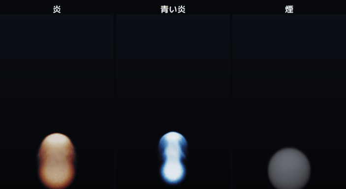
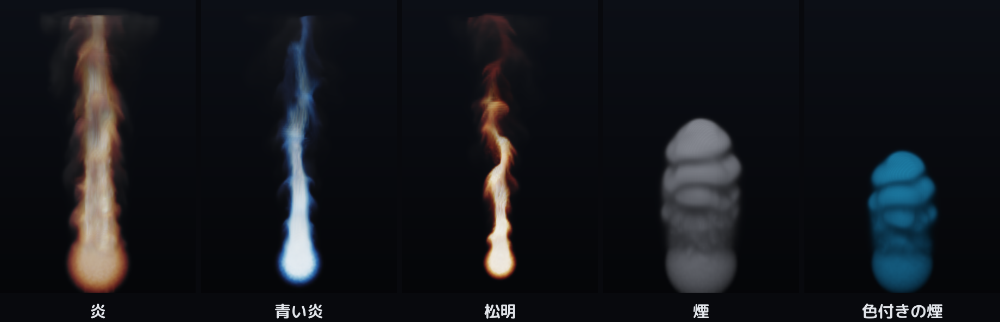

# volsmoke

3D グリッド上で流体方程式 (Navier-Stokes) を GPU で解き、密度・温度場を
ボリュームレイマーチで立体描画するリアルタイムの煙＆炎デモ。炎・煙を
ウィンドウ内のスライダーでその場で作り変えられる。自作エンジン
[MitiruEngine](https://github.com/mogmog-0110/MitiruEngine) の DX12 コンピュート基盤の上に実装。




## 仕組み (1 フレーム / 128³ グリッド)

注入 → 移流 → 浮力 → 渦confinement → 圧力射影 (Jacobi 40 反復) → ボリュームレイマーチ。
炎は温度を黒体放射色に写像して発光、煙は光方向への 2 段目マーチで自己影を付ける。
全フィールドは `RWTexture3D` で読み書きする全コンピュート実装。

## ビルド (Windows / VS2022 / C++20)

```bash
cmake -B build -G Ninja -DMITIRU_ROOT=E:/user/MitiruEngine
cmake --build build
```

## 実行

```bash
volsmoke --interactive                       # ライブ調整 (窓内でレイアウト/プリセット/スライダー)
volsmoke --interactive --compare fire,blue,smoke   # 複数を横並びで同時比較
volsmoke --compare fire,blue,smoke --out a.png     # ヘッドレスで画像 1 枚
```

プリセット: `fire` / `blue` / `torch` / `smoke` / `ink`。窓内の Layout ボタンで 1〜4 面、各タイルのプリセットを切替。

## 下敷きにした手法

Stam, Stable Fluids (1999) / Fedkiw, Stam & Jensen, Visual Simulation of Smoke (2001) /
Nguyen, Fedkiw & Jensen, Animation of Fire (2002) / Crane, Llamas & Tariq, GPU Gems 3 (2007)。

---

Copyright (c) 2026 mogmog-0110
